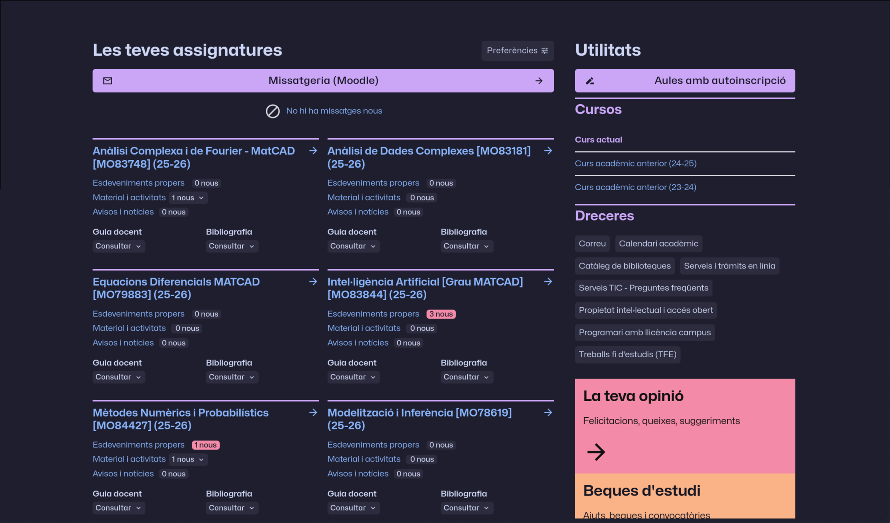
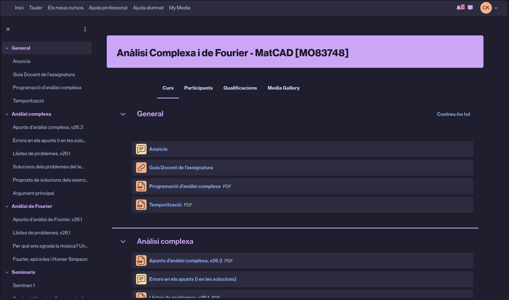
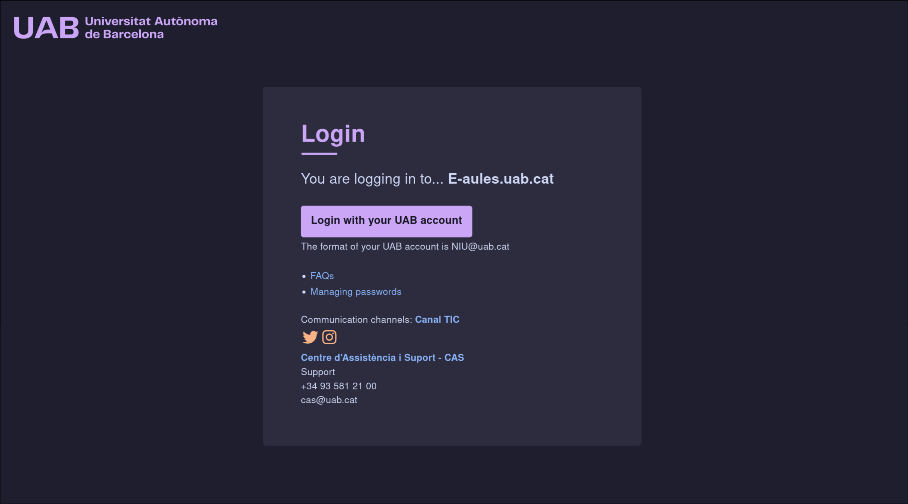
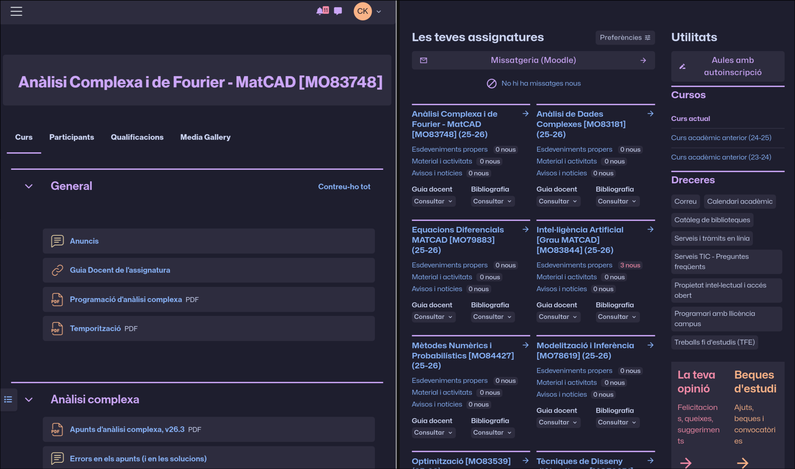
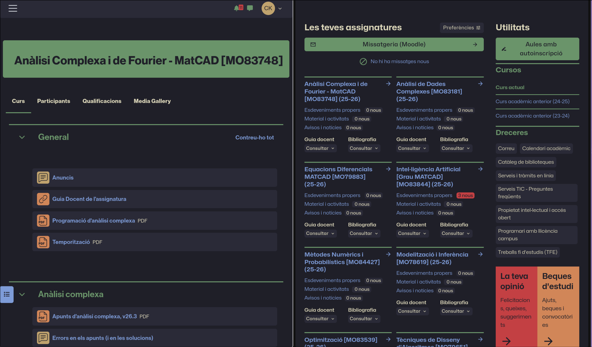
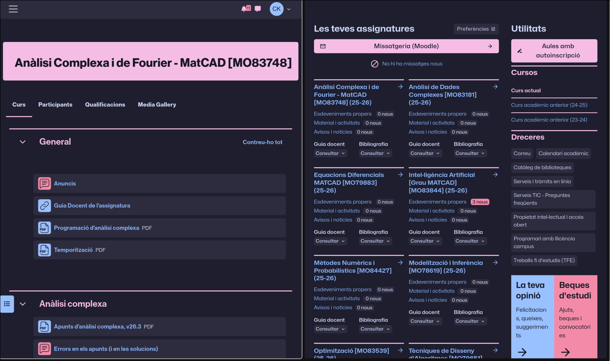
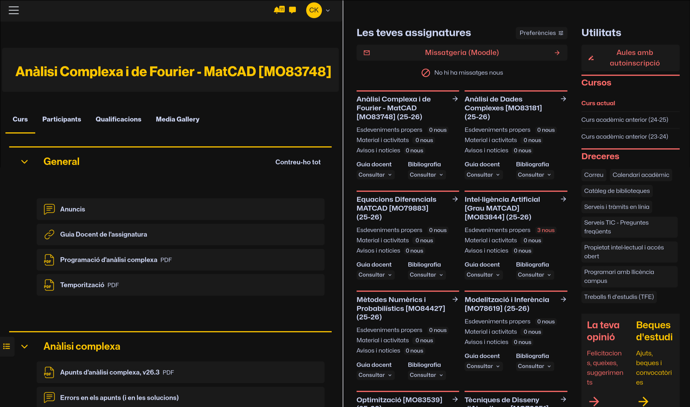

# Instalation
For both of the below installation methods, you will need the Stylus browser extension installed. Install [Stylus](https://github.com/openstyles/stylus) for [Chrome](https://chromewebstore.google.com/detail/stylus/clngdbkpkpeebahjckkjfobafhncgmne?pli=1) or [Firefox](https://addons.mozilla.org/en-GB/firefox/addon/styl-us/). If you use Chrome, make sure to enable “Allow access to file URLs” in the Chrome extension settings for Stylus (`visit chrome://extensions/?id=clngdbkpkpeebahjckkjfobafhncgmne`).

Enable CSP Patching from Stylus’s **Settings > Advanced**.
[Install the style](https://raw.githubusercontent.com/soks-kat/campus-virtual-theming/refs/heads/main/e_aules.user.less)

# Usage
This style comes with two customisation settings.

Colourfull which includes: Gay (a more colourfull theming) and Clean (a more minimal theming)

Colourscheme which includes: Catppuccin, Kanagawa, Trans and Gaymer and Custom which you can set by localhosting at port **3011** a file called `custom.less` which must follow this format

```
@custom: {
    @background: #1e1e2e;
    @background-light: #2d2c3e;
    @background-lighter: #45475a;
    @background-dark: #181825;

    @text: #cdd6f4;
    @text-dark: #181825;
    @text-disabled: #857da8;

    @primary: #cba6f7;
    @primary-b: #a177d1;
    @secondary: #fab387;
    @secondary-b: #f58e6a;
    @tertiary: #89b4fa;
    @four: #f38ba8;

    @red: #f38ba8;
    @red-b: #dd6887;
    @orange: #fab387;
    @orange-b: #f58e6a;
    @yellow: #f9e2af;
    @yellow-b: #fbd98d;
    @green: #a6e3a1;
    @green-b: #83d37d;
    @blue: #89b4fa;
    @blue-b: #6c99e2;
    @purple: #cba6f7;
    @purple-b: #a177d1;

    @link: #89b4fa;
    @link-b: #6c99e2;
};
```






Themes:





The gamer colourscheme has cycling rainbows, you cannot see it in the screenshot.

